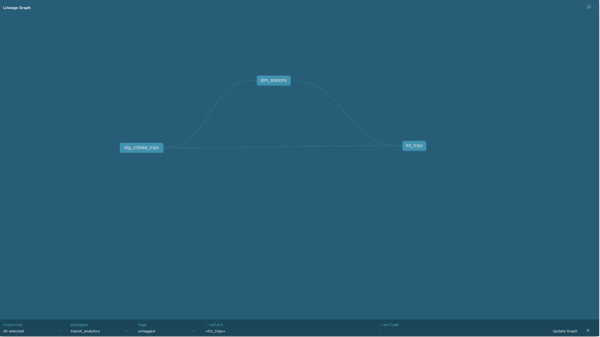

# NYC Citi Bike Analytics Pipeline

An end-to-end analytics pipeline built on **BigQuery + dbt + Looker Studio**, transforming 61.7 million raw NYC Citi Bike trips into a production-ready star schema and interactive dashboard.


---

## What This Project Does

Raw public data → cleaned staging layer → dimensional model → BI dashboard.

The pipeline ingests NYC Citi Bike trip data from BigQuery's public dataset, applies transformation logic using dbt, and surfaces KPIs in a Looker Studio dashboard — modeling the exact analytics engineering workflow used in production data teams.

**[View Live Dashboard →](https://datastudio.google.com/reporting/f2d827d0-d9c0-40b8-b4ba-f0fb045bc9f7/page/9CKwF)**

---

## Tech Stack

| Layer | Tool |
|-------|------|
| Data Warehouse | Google BigQuery |
| Transformation | dbt (dbt-bigquery) |
| BI / Visualization | Looker Studio |
| Language | SQL, Python |
| Version Control | Git / GitHub |

---

## Data Model (Star Schema)



```
bigquery-public-data.new_york_citibike.citibike_trips   ← source
                        ↓
            stg_citibike_trips  (view)
            ├── Filters null/invalid trips
            ├── Converts duration to minutes
            └── Extracts time dimensions (year, month, hour, is_weekend)
                        ↓
        ┌───────────────┴───────────────┐
   dim_stations (table)           fct_trips (table)
   1,000 unique stations          61.7M rows
   station_id, name,              All trip fields +
   latitude, longitude            trip_length_category
```

---

## Key Metrics

| Metric | Value |
|--------|-------|
| Total trips | 61.7 million |
| Date range | 2013 – 2018 |
| Unique stations | ~1,000 |
| Avg trip duration | ~16 minutes |
| Subscriber share | ~88% |
| Peak hour | 8 AM & 5–6 PM |

---

## Dashboard KPIs

- **Total trips by year** — ridership growth 2013–2018
- **Subscriber vs casual riders** — user type breakdown
- **Trips by hour of day** — peak commute hours vs leisure
- **Scorecards** — total trips, avg duration, unique stations

---

## Project Structure

```
transit_analytics/
├── models/
│   ├── staging/
│   │   └── stg_citibike_trips.sql    ← cleaning + derived fields
│   └── marts/
│       ├── dim_stations.sql          ← dimension table
│       └── fct_trips.sql             ← fact table (star schema)
├── dbt_project.yml
├── screenshots/
│   └── dashboard.png
└── README.md
```

---

## How to Run

**Prerequisites:** Python 3.11+, Google Cloud account, dbt-bigquery

```bash
# 1. Clone the repo
git clone https://github.com/adij27/transit-analytics-pipeline.git
cd transit-analytics-pipeline

# 2. Set up virtual environment
python3.11 -m venv dbt-env
source dbt-env/bin/activate
pip install dbt-bigquery

# 3. Authenticate with Google Cloud
gcloud auth application-default login
gcloud auth application-default set-quota-project YOUR_PROJECT_ID

# 4. Run the pipeline
dbt run

# 5. Run tests
dbt test
```

---

## Skills Demonstrated

- **Dimensional modeling** — star schema with fact and dimension tables
- **dbt** — staging → marts pipeline, materialization strategy, `ref()` dependency management
- **Data quality** — 16 dbt tests (not_null, unique, accepted_values) across all models
- **dbt documentation** — auto-generated data catalog with column descriptions and lineage graph
- **BigQuery** — cloud data warehouse, SQL optimization, table vs view materialization
- **BI reporting** — Looker Studio connected to BigQuery tables
- **Version-controlled analytics** — full Git workflow

---

*Built by [Aditya Jadhav](https://linkedin.com/in/aditya-jadhav-547b58197) · M.S. Data Analytics, NMSU*
